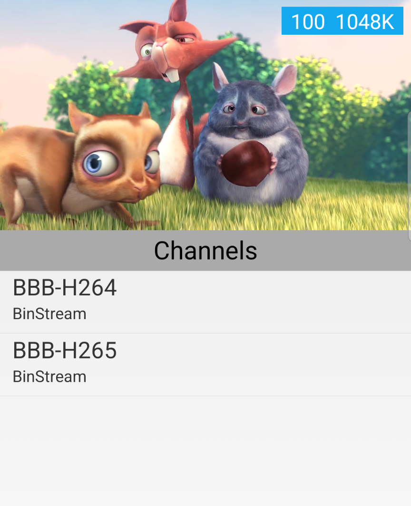

tvbus.android
=================

tvbus.android is a live streaming android SDK based on P2P technology.

Features
------

1. Extremely bandwidth saving.
2. Totally compatible with Android native player.
3. HEVC support.
4. Multiple platform(Android, Windows, macOS) support.

UI
-----

How to use
-----

Please refer to the demo in the repository.

More info
----
www.binstream.io
